> Graduation Project - Readme

# skill-link-tracker

> SkillLink is a platform for seamless skill exchange, connecting users to teach, learn, and grow through interactive tools and a user-friendly interface.

# Project Drive

> The project-related documentation, including the presentation and project requirements, is available on the following Google Drive:

  <a href="https://drive.google.com/drive/folders/10ju1ZlKXhn1h9zhIWO3pK5izMur8JiCS?usp=sharing">Project Drive Link</a>

## Team Members

| Name                                                                                          | Role                |
| --------------------------------------------------------------------------------------------- | ------------------- |
| [Mohamed Salem](linkedin.com/in/mohamed-salem149)                                             | Front-End Developer |
| [Mohamed Refaat](linkedin.com/in/https://www.linkedin.com/in/mohammed-refaat-60b43324a)       | Front-End Developer |
| [Ezzeldin Morgan](linkedin.com/in/https://www.linkedin.com/in/ezzeldin-morgan-7b9150272/)     | Back-End Developer  |
| [Mohamed Waheed](linkedin.com/in/https://www.linkedin.com/me?trk=p_mwlite_feed-secondary_nav) | Back-End Developer  |

## Features

- User Dashboard
- Admin Dashboard
- Real-time Communication
- Google Meet Integration
- Skill Exchange Mechanism

## Project Screens

### Landing Page

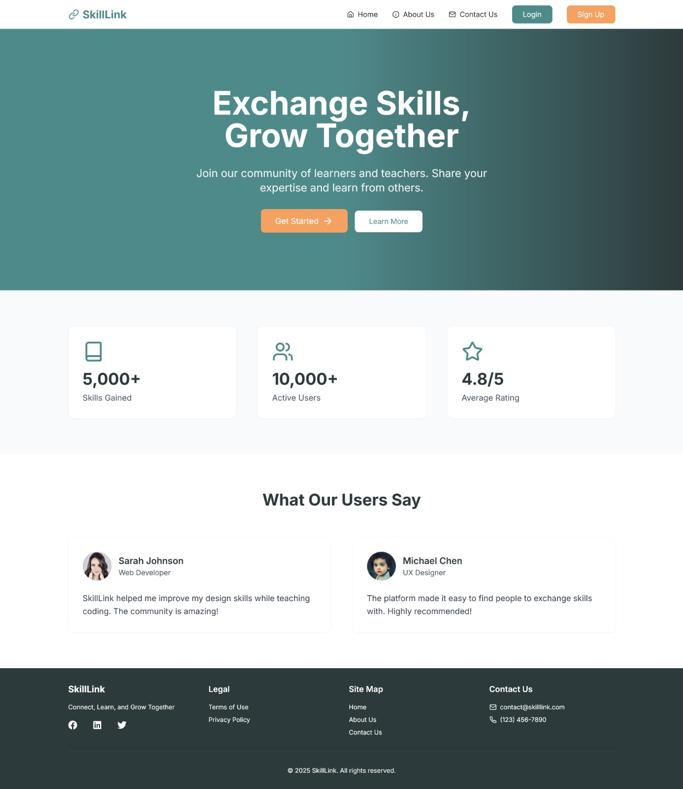

### About Page

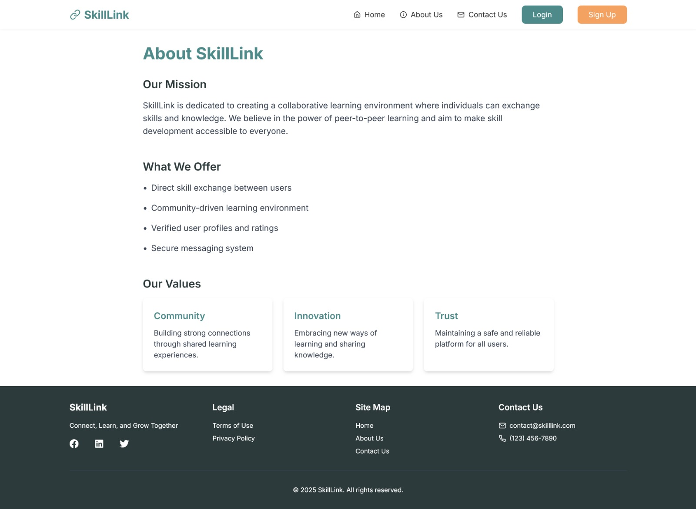

### Contact Us Page

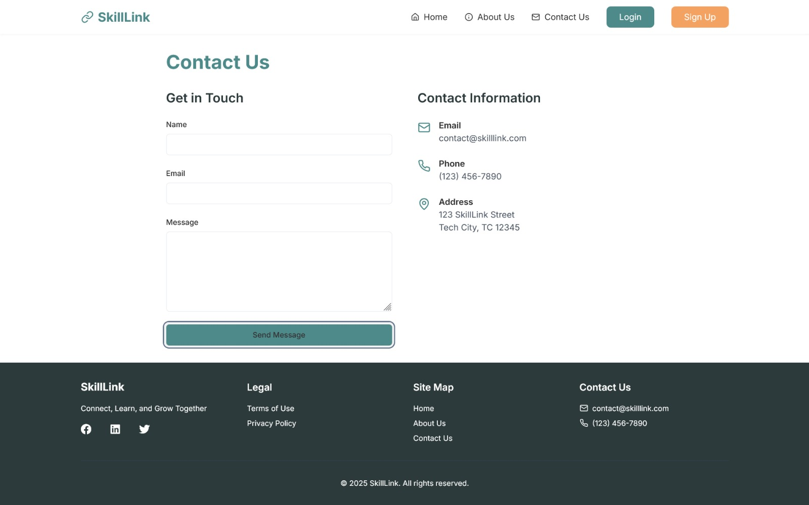

### Sign Up Page

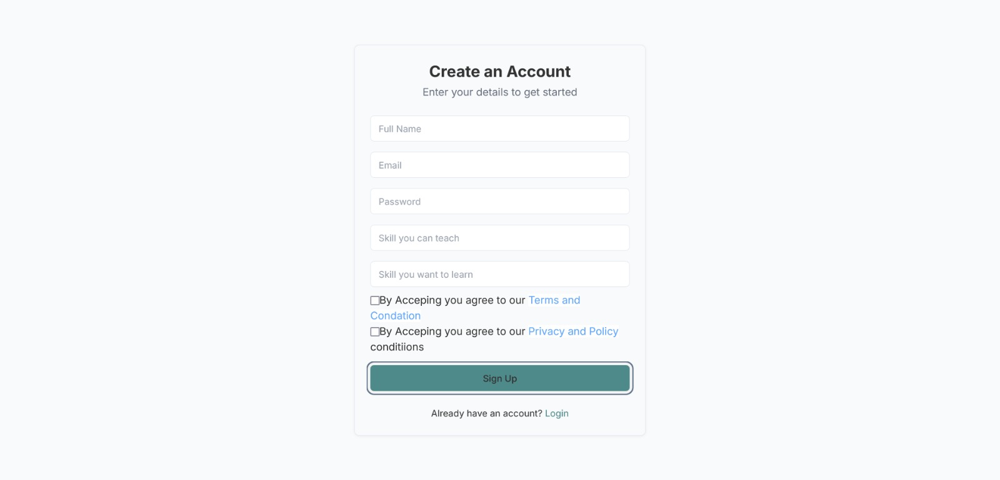

### Login Page

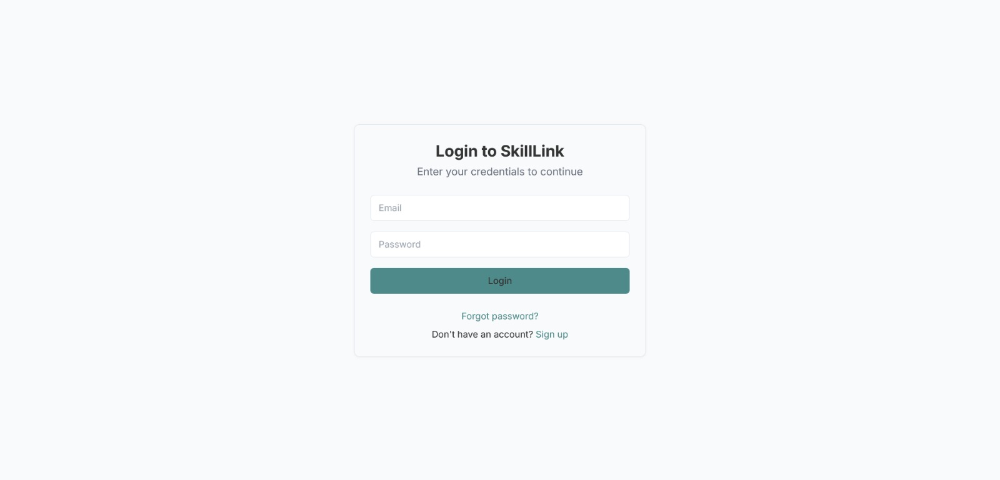

### Terms And Conditions Page

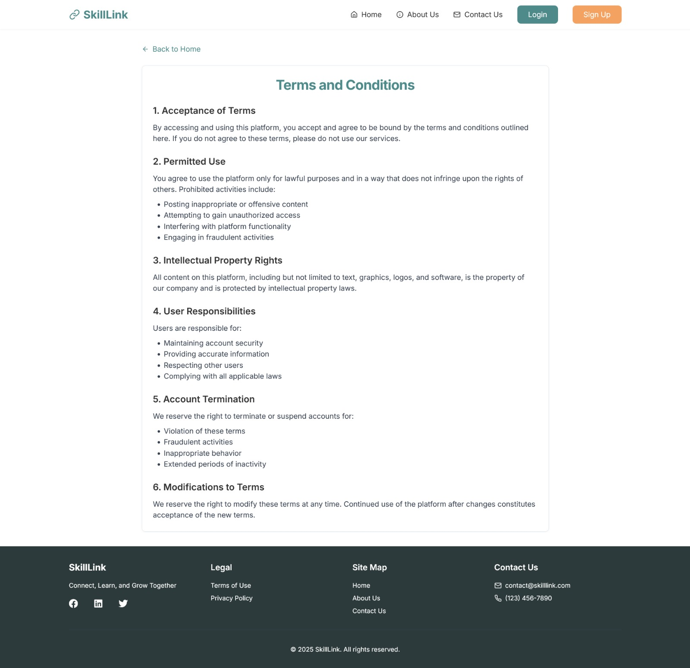

### Privacy Policy Page

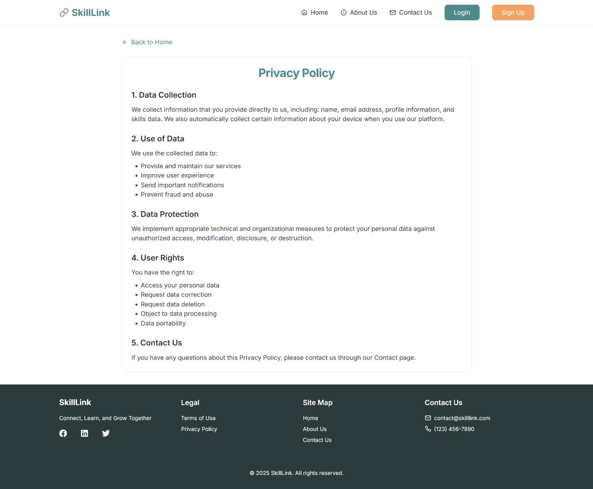

### Admin Dashboard Page

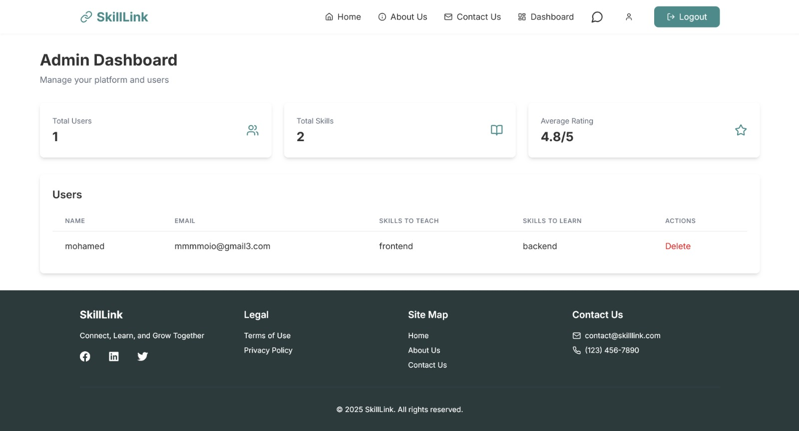

### Admin Messages Page

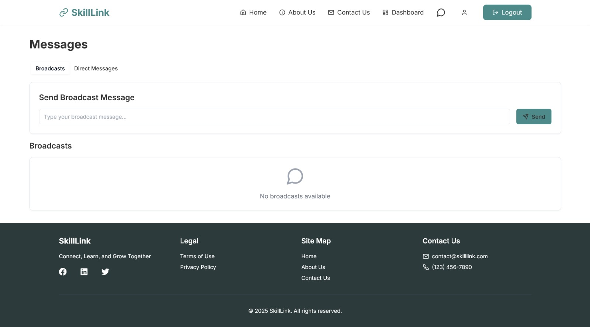

### Admin Profile Page

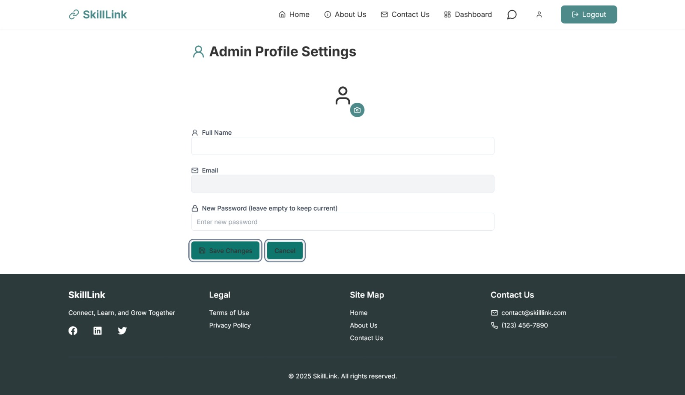

### User Dashboard Page

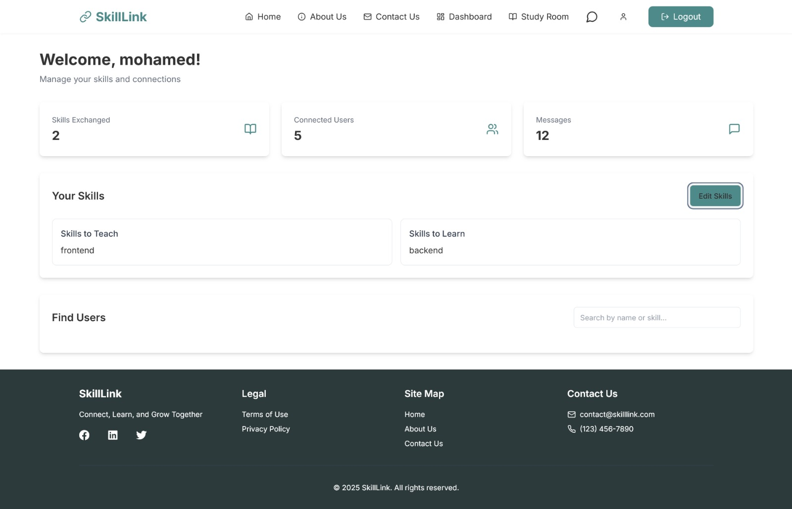

### User Study Room Page

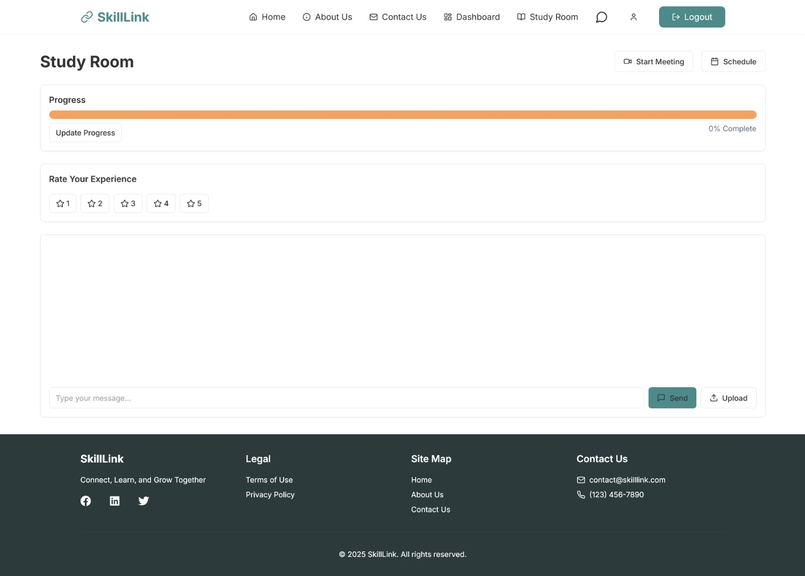

### User Messages Page

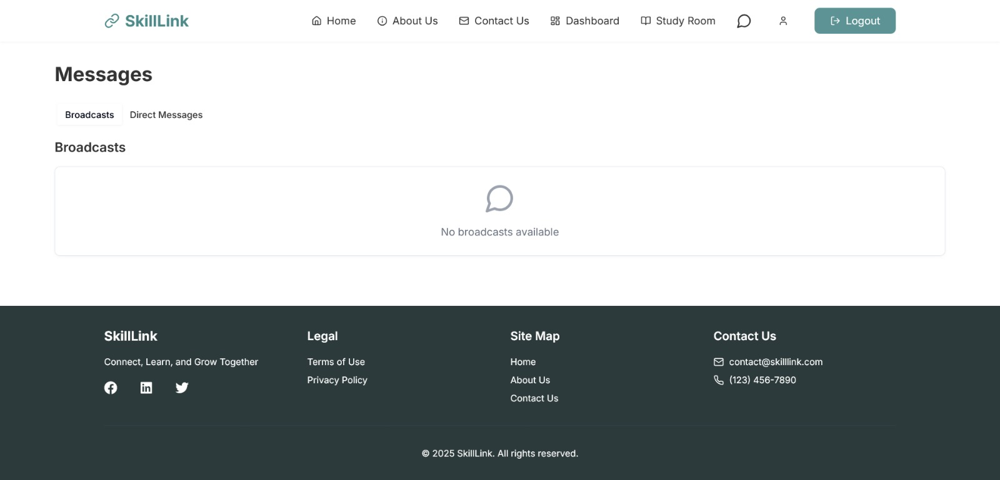

### User Profile Page

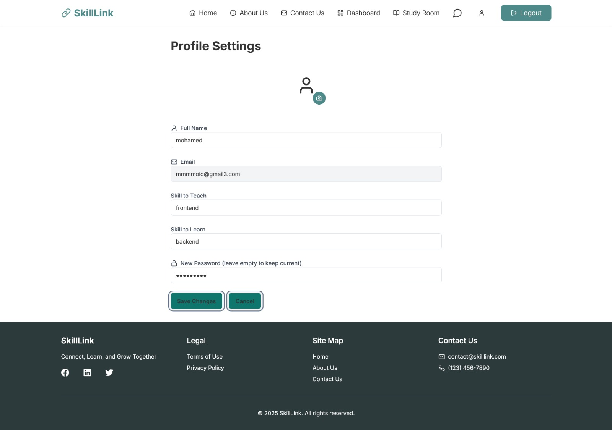

## Technologies

- **Frontend**:
  - React.js
  - TailwindCSS
  - Vite.js
- **Backend**:
  - Node.js
  - Express.js
  - MongoDB
- **Other Tools**:
  - Google Meet API
  - Jest
  - TypeScript

## Folder Structure

- **frontend/**: Contains the frontend code of the application.
- **backend/**: Contains the backend code of the application.

## SkillLink Team License

This project, SkillLink, is developed as part of a collaborative team effort.

## Authors

- **Mohamed Salem** - [MoSalem149](https://github.com/MoSalem149)
- **Mohamed Refaat** - [mohammed6699](https://github.com/mohammed6699)
- **Ezzeldin Morgan** - [Ez-114](https://github.com/Ez-114)
- **Mohamed Waheed** - [Mohamedwaheed221](https://github.com/Mohamedwaheed221)
